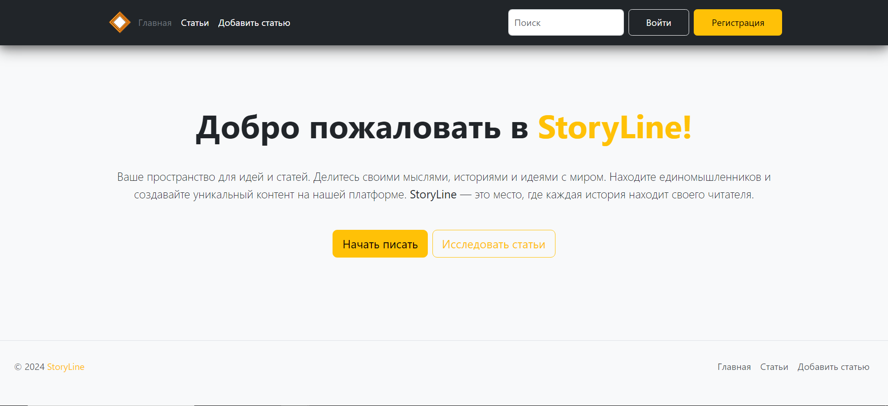
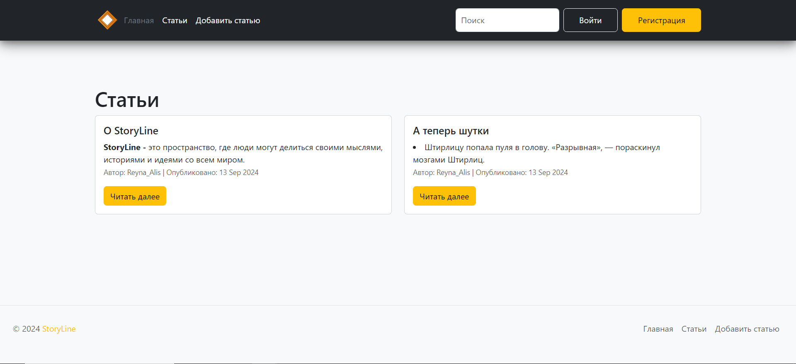

# StoryLine

**StoryLine** — это пространство, где люди могут делиться своими мыслями, историями и идеями со всем миром.

## Технологии, которые были использованы при разработке этого приложения:

- **Flask (Python)**: развернута серверная часть, управление пользовательскими сессиями, создание маршрутов для страниц и организация взаимодействия с базой данных.
- **SQLite**: хранение данных о пользователях и статьях.
- **HTML, CSS и Bootstrap**: создание адаптивного интерфейса.
- **Jinja2**: динамическая подгрузка данных в HTML-страницы.
- **CKEditor**: подключен текстовый редактор.

## Функциональность сайта

StoryLine — это платформа, которая позволяет пользователям регистрироваться, публиковать статьи и читать материалы других авторов.

### Основные функции сайта включают:

- **Регистрация и авторизация**: Пользователи могут создавать аккаунты, входить в систему и выходить.
- **Создание и редактирование статей**: После авторизации пользователи могут писать статьи и публиковать их на сайте. Также есть возможность редактировать уже опубликованные материалы. В проект подключен текстовый редактор, который позволяет пользователям легко форматировать текст и создавать более структурированные и привлекательные статьи.
- **Поиск и исследование**: С помощью поисковой строки пользователи могут находить статьи по ключевым словам. Это упрощает навигацию и помогает быстрее находить интересующий контент.

#### Протестировать приложение вы можете тут: [https://storyline-yu13.onrender.com/](https://storyline-yu13.onrender.com/). Буду рада увидеть и вашу историю!
